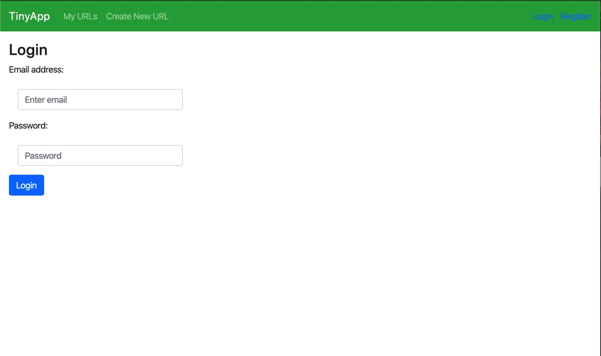
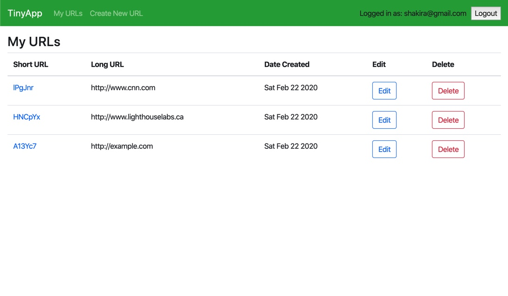
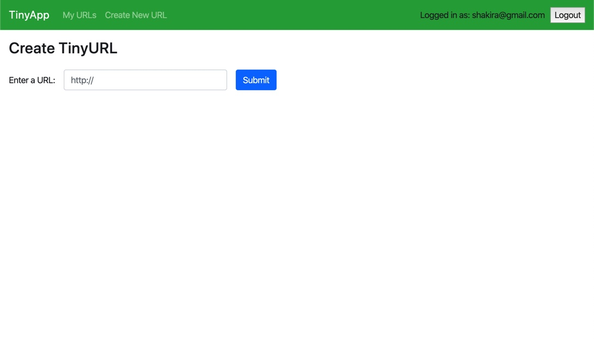
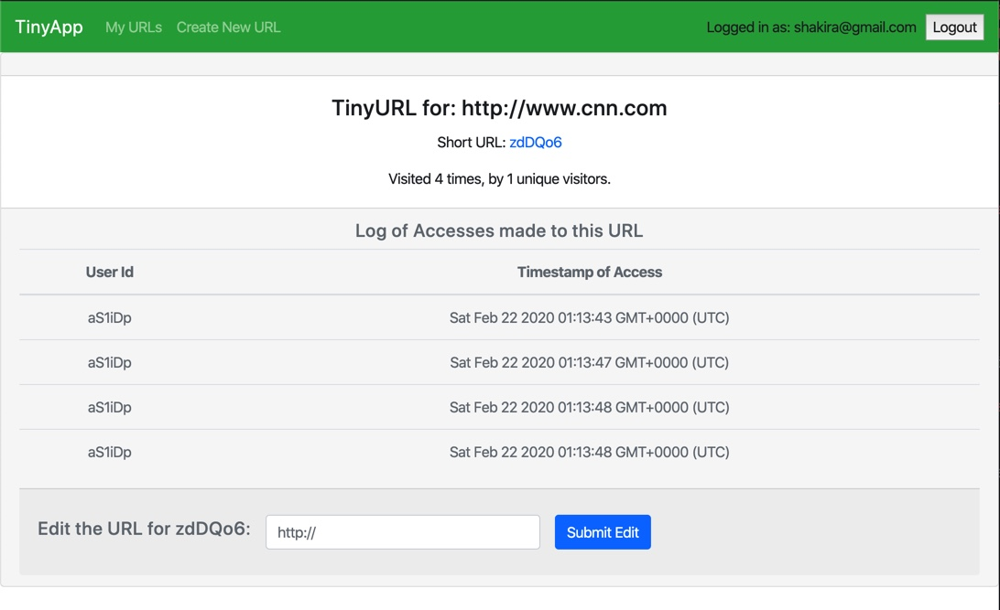

# TinyApp Project

#### A full stack web app built with Node and Express that allows users to shorten long URLs (à la bit.ly).

## Final Product:

#### Login Page:

#### Display All URLs:

#### Create a TinyUrl:

#### Display a TinyUrl with usage statistics:

## Dependencies

- Node.js
- Express
- EJS
- bcrypt
- body-parser
- cookie-session

## Getting Started

- Install all dependencies (using the `npm install` command).
- Run the development web server using the `node express_server.js` command.

## Next Steps

- Improve UI/UX
- Create an unique identity and visual language
- Implement minimal data persistency by saving the "databases" into a JSON file
